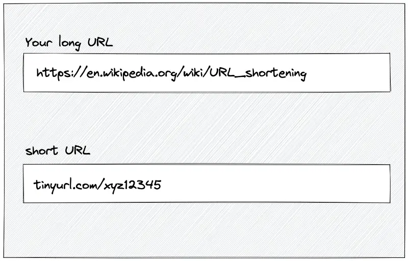
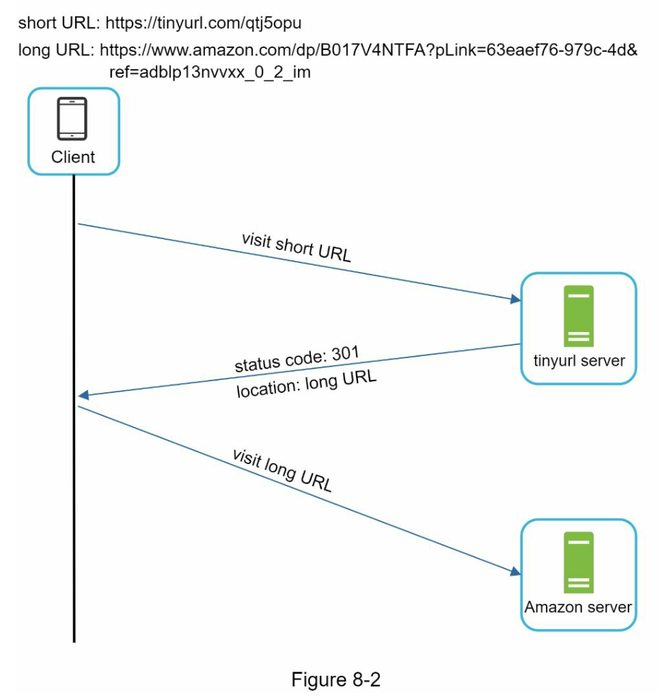
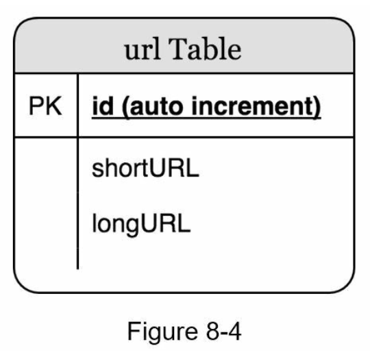
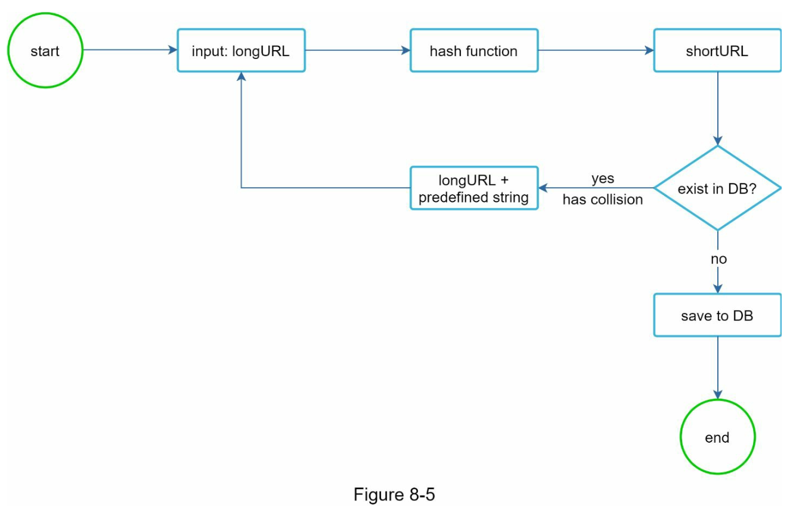
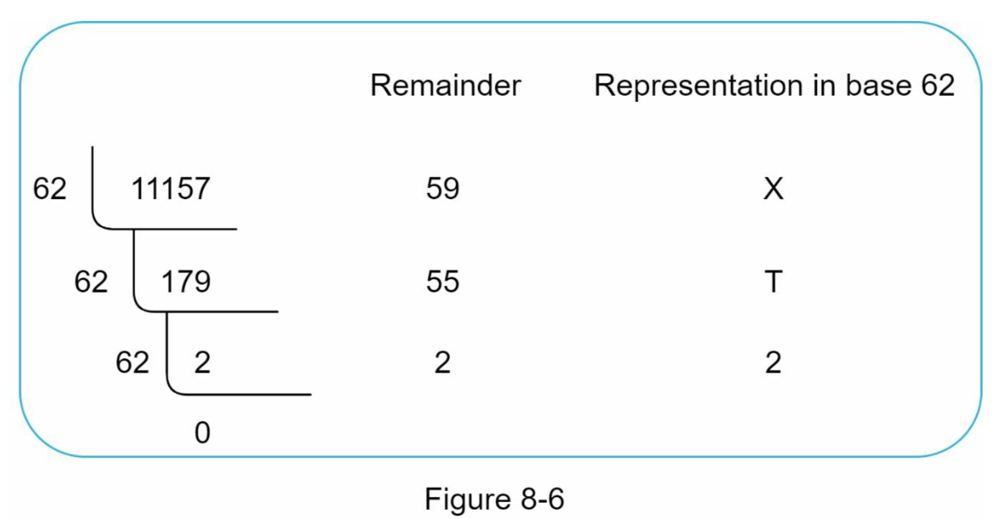
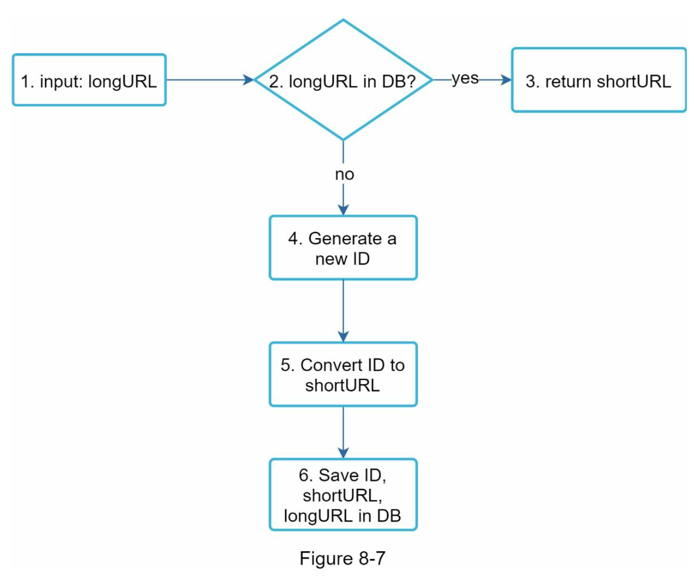
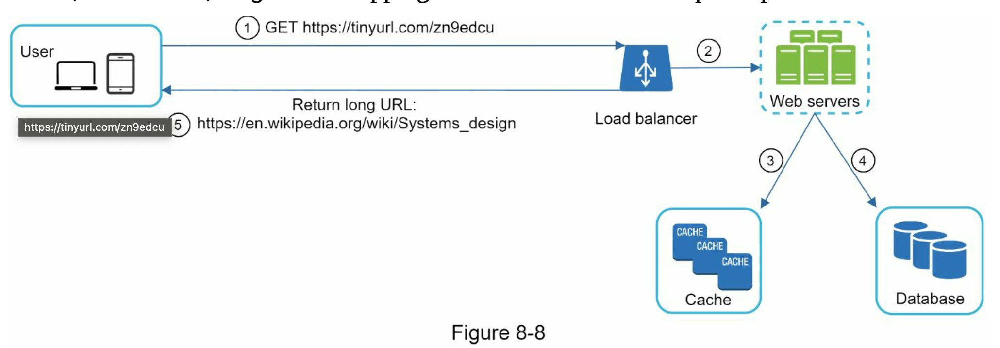

# URL Shortener System Design Analysis

---

## 1. Problem Statement

A URL shortener is a service that takes a long web address and turns it into a much shorter one. For example, a link like `https://www.systeminterview.com/q=chatsystem&c=loggedin&v=v3&l=long` can be shortened to something like `https://tinyurl.com/y7keocwj`. When someone clicks the short link, they get sent to the original long URL automatically.



Reading through the chapter, I understood that the goal is not just to make this work but to make it work for a very large number of people at the same time.

### Key Requirements

The chapter starts with an interview where a candidate asks the interviewer clarifying questions. From that conversation, these are the main requirements I noted down:

- The system should accept a long URL and return a shorter one
- Clicking the short URL should redirect the user to the original URL
- The system needs to handle 100 million new URLs every day
- The short URL should be as short as possible, ideally 7 characters
- Only alphanumeric characters are allowed in the short URL: `[0-9, a-z, A-Z]`
- Short URLs cannot be updated or deleted

### Scale Estimates

Before jumping into any design, the chapter works out rough numbers to understand how big the system needs to be:

| Metric | Value |
|---|---|
| Writes per second | around 1,160 |
| Reads per second | around 11,600 |
| Storage needed over 10 years | around 365 TB |

I found this useful because it helped explain why certain design choices were made later on.

---

## 2. Analysis of Proposed Solutions

### API Design

The chapter explains that the system only needs two API endpoints to work. An API endpoint is basically a way for a client (like a browser) to communicate with the server.

```
POST /api/v1/data/shorten   → the client sends a long URL and gets back a short URL
GET  /api/v1/{shortUrl}     → the client visits a short URL and gets redirected
```

### 301 vs 302 Redirect

When someone clicks a short URL, the server needs to send them to the original URL. The chapter explains two ways this can happen.

A 301 redirect is permanent. The browser saves the redirect and next time it skips the server and goes directly to the original URL. This puts less load on the server but means you cannot track how many people are clicking the link.

A 302 redirect is temporary. Every time someone clicks the link, the request goes through the server first. This uses more server resources but allows the system to track clicks and collect data.



The chapter says that the choice depends on what is more important for the business, saving server resources or collecting analytics.

### Data Model

At first the chapter suggests storing all URL mappings in a hash table in memory. But then it points out that memory is limited and expensive, especially at 365 TB of data. The better solution is to use a relational database with a simple table that has three columns:

| id | shortURL | longURL |
|---|---|---|
| 2009215674938 | zn9edcu | https://en.wikipedia.org/wiki/Systems_design |



### Hash Function

A hash function is used to turn a long URL into a short 7 character code. The chapter explains why 7 characters is enough. Using 62 possible characters (10 digits, 26 lowercase, 26 uppercase), 7 characters can produce around 3.5 trillion unique combinations which covers the 365 billion URLs the system needs to support.

Two approaches are discussed:

Approach 1: Hash and Collision Resolution

This uses known hash functions like CRC32, MD5 or SHA-1 on the long URL and takes the first 7 characters of the result. The problem is that sometimes two different long URLs can produce the same 7 characters, which is called a collision. To fix this, the system adds extra characters to the original URL and tries again until it finds a unique result. To avoid querying the database on every attempt, the chapter recommends using a Bloom filter. A Bloom filter is a space efficient data structure that can quickly check whether a short URL already exists. Instead of hitting the database each time, it tells the system whether something definitely does not exist, which reduces unnecessary database calls and makes the collision resolution process faster.



Strengths: the short URL length stays fixed and no separate ID generator is needed.

Weaknesses: collisions can happen and checking for them repeatedly can be slow.

Approach 2: Base 62 Conversion

Instead of hashing, this approach takes the auto-incremented ID from the database and converts it from a regular number into a base 62 representation. The chapter gives an example where the number 11157 converts to 2TX in base 62, making the short URL `https://tinyurl.com/2TX`.



Strengths: since every database ID is unique, there are no collisions at all. This also means a Bloom filter is not needed here since duplicate IDs simply cannot occur.

Weaknesses: the length of the short URL grows as IDs get larger, and because IDs go up by one each time, the next available short URL is easy to predict which could be a security concern.

The chapter recommends base 62 conversion as the preferred approach.



### URL Redirecting Flow

Since read operations happen around 10 times more often than write operations, the chapter introduces a cache layer to reduce pressure on the database. When a user clicks a short URL, the system follows these steps:

1. The request goes through a load balancer to a web server
2. The server checks the cache for the short URL
3. If it is found in the cache, the long URL is returned immediately
4. If it is not in the cache, the database is queried
5. The long URL is returned to the user and also saved in the cache for future requests



### Additional Points from the Wrap Up

The chapter also briefly mentions several things that can make the system better:

- Rate limiting can stop people from sending too many requests and abusing the system
- Web servers are stateless so more servers can be added easily when traffic increases
- The database can be scaled using replication and sharding
- Analytics can be added to track how often links are clicked and where users are coming from

---

## 3. My Understanding and Confusions

### What I Understood

I had no idea before reading this that something as simple as a short link involves so many decisions. Knowing that the system needs to handle 11,600 reads per second and store 365 TB of data made it clear why a simple solution would not work and why a database, cache and load balancer are all needed.

The 301 vs 302 redirect was also something I found interesting. I did not know that there were different types of redirects or that the choice between them affects whether you can track user clicks.

The base 62 conversion example with 11157 turning into 2TX was easy to follow and helped me understand how a number becomes a short URL code.

### What Confused Me

The chapter introduces Bloom filters as a way to speed up collision checking. From what I understand, a Bloom filter is a space efficient data structure that helps check whether a short URL already exists before querying the database. Instead of hitting the database every single time, the Bloom filter can quickly tell if something definitely does not exist, which saves a lot of unnecessary database calls. What I am still not fully clear on is how it handles false positives, where it says something might exist but it actually does not, and how that affects the overall collision resolution process.

The distributed unique ID generator was also something I had to think about more carefully. For base 62 conversion to work, every URL needs a globally unique ID. But when multiple servers are running at the same time, making sure no two servers generate the same ID is not straightforward. I am still unsure how that coordination between servers works in practice.

The security concern with base 62 is something I found interesting but unresolved. Since short URLs are based on incrementing IDs, anyone who knows one short URL could potentially guess the ones before and after it. I understand why this is a problem but I am not sure what the standard solution would look like in a real system.

### Things I Want to Learn More About

- How Bloom filters handle false positives and what impact that has on performance?
- How unique IDs are generated reliably when multiple servers are running at the same time?
- What happens to cached data if a URL ever needs to be changed or removed?
- How database sharding works in practice?
- What the difference is between the different rate limiting methods the chapter briefly names?

---

## 4. Summary

After reading this chapter, I feel like I have a basic understanding of how a URL shortener works at a system level. The design covers the API, how redirects work, how short codes are generated using base 62 conversion, and how caching helps with performance under heavy read traffic.

What I found most valuable was the approach of estimating scale before designing anything. It made the technical choices easier to understand because there was always a reason behind them.

At the same time, a few things were left incomplete. The distributed unique ID generator is important for base 62 conversion to work but is not explained in this chapter. The base 62 security concern is also raised but not resolved, which left me with more questions than answers on those parts.

---

## References

- Alex Xu, System Design Interview: An Insider's Guide, Chapter 8: Design a URL Shortener https://bytes.usc.edu/~saty/courses/docs/data/SystemDesignInterview.pdf
- Bloom filter: https://en.wikipedia.org/wiki/Bloom_filter
- REST API Tutorial: https://www.restapitutorial.com/index.html
