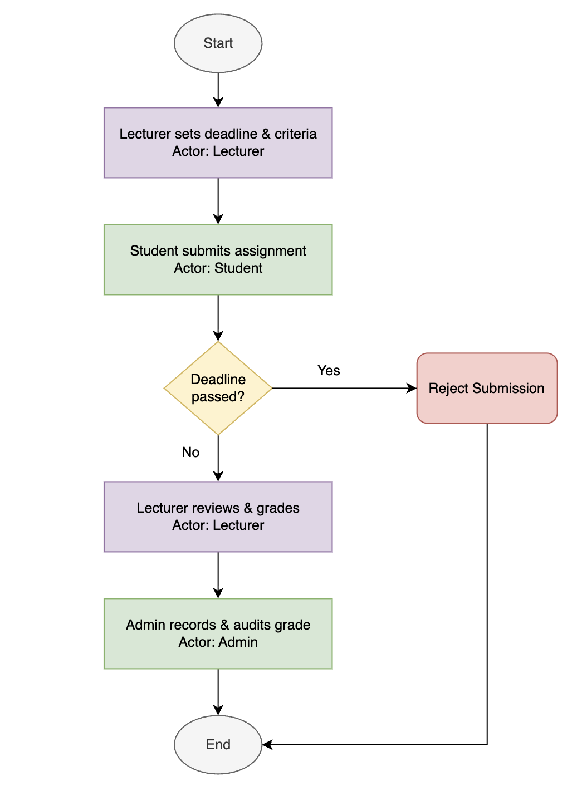
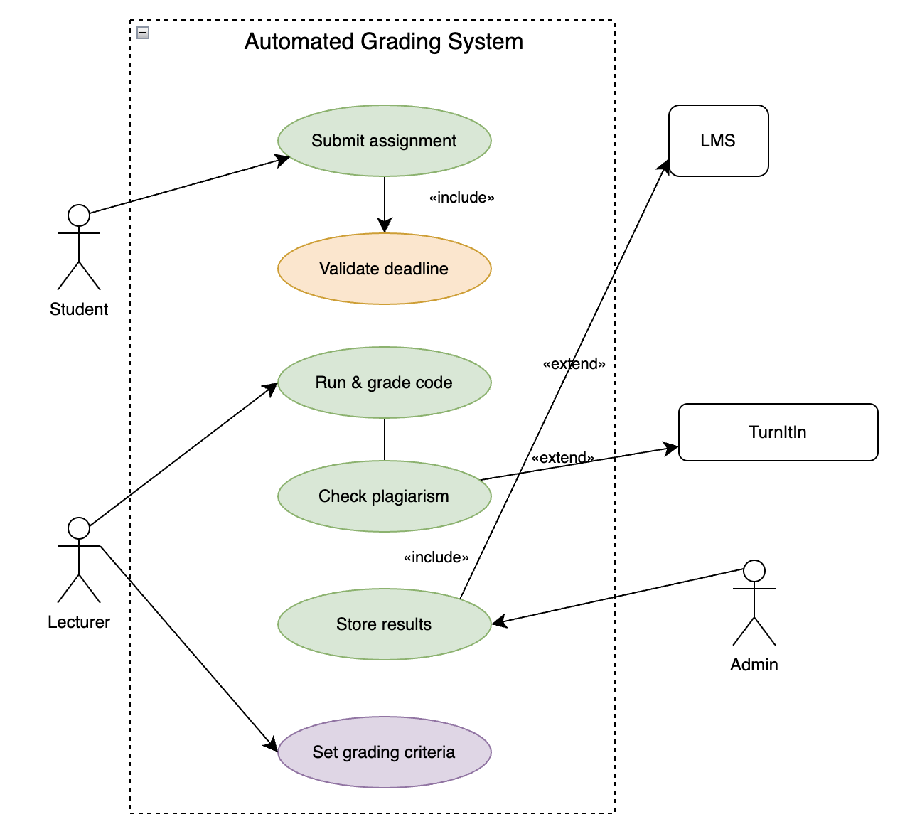
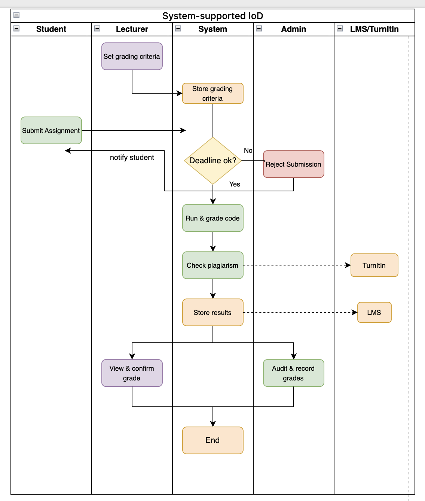

# SDA202 Practical 2 — UML Use Case Diagram

## Problem Scenario

A university wants to automate the grading of programming assignments.
Currently, professors manually clone student GitHub repositories, run
code in terminal, and inspect it in VSCode. There is no plagiarism
checker or automated marking software.

**Users:** 300+ students per year, plus staff and admin.

### Requirements
1. Students must be able to upload their source code, which will be run and graded
2. Grades and runs must be persistent and auditable
3. Plagiarism detection by comparing submissions and submitting to TurnItIn
4. Integration with the University LMS
5. Professor sets due date and time, after which submissions are rejected
6. Students can submit as many attempts as they want to improve their grade
7. Professors determine grading criteria, which may include metrics and/or tests

### Additional Context
- The University LMS is mainframe based and difficult to change
- Grades are audited each year by a state-based regulatory body
- The University has very little budget for IT
- The University has a record for highest-performing SWE graduates in the country

---

## Actors

| Actor | Role |
|---|---|
| Student | Submits assignments, receives grades |
| Lecturer | Sets criteria, deadlines, reviews grades |
| Admin | Records and audits grades |
| LMS | External system that receives stored results |
| TurnItIn | External plagiarism detection service |

---

## Task 1 — Interaction Overview Diagram (Actor-to-Actor)

> Show only interactions between actors, with no system actions involved.
> This represents the real-world flow before any system is built.



### Explanation

This diagram shows how the actors interact with each other in the real
world before any system is involved. The Lecturer starts by setting the
deadline and criteria, then the Student submits their assignment. A
decision is made on whether the deadline has passed. If yes, the
submission is rejected and the flow ends. If no, the Lecturer manually
reviews and grades it, and finally Admin records and audits the grade.

---

## Task 2 — Use Case Diagram (System View)

> Define what the system needs to do in order to support the actor
> interactions identified in Task 1.



### Explanation

This diagram shows what the system needs to be able to do in order to
support those actor interactions. The Student can submit an assignment,
which always triggers deadline validation via «include». The Lecturer
can run and grade code and set grading criteria. Checking plagiarism
optionally calls TurnItIn via «extend», and storing results optionally
syncs with LMS via «extend». Admin has access to store results for
auditing purposes. All use cases sit inside the system boundary.

### Relationships Used

| Relationship | Between | Reason |
|---|---|---|
| «include» | Submit assignment → Validate deadline | Deadline check is mandatory on every submission |
| «include» | Run & grade code → Store results | Results must always be stored after grading |
| «extend» | Check plagiarism → TurnItIn | TurnItIn is optional and external |
| «extend» | Store results → LMS | LMS sync is optional due to mainframe constraints |

---

## Task 3 — System-Supported Interaction Overview Diagram

> Show how actors interact with each other through the system, combining
> the flows from Task 1 and the use cases from Task 2.



### Explanation

This diagram combines the previous two. It shows the same actor
interactions from Task 1, but now the system is in the middle doing
the actual work. The Lecturer sets criteria and the system stores it.
The Student submits and the system validates the deadline, either
rejecting the submission or proceeding to run the code, check plagiarism
via TurnItIn, and store results via LMS. Finally the Lecturer confirms
the grade and Admin audits it.

### Swimlanes

| Lane | Responsibility |
|---|---|
| Student | Submits assignment, receives rejection notification |
| Lecturer | Sets grading criteria, views and confirms grade |
| System | Validates deadline, runs code, checks plagiarism, stores results |
| Admin | Audits and records grades |
| LMS/TurnItIn | Receives stored results and plagiarism check requests |

---

## Consistency Check

| Element | Task 1 | Task 2 | Task 3 |
|---|---|---|---|
| Submit assignment | Student submits | Use case | Student lane |
| Validate deadline | Decision diamond | «include» from submit | System decision node |
| Run & grade code | Lecturer grades manually | Use case | System lane |
| Check plagiarism | Not yet present | Use case with «extend» | System lane with TurnItIn |
| Store results | Admin records | Use case | System lane with LMS |
| Set grading criteria | Lecturer sets | Use case | Lecturer lane |

---

## Source Files

The editable draw.io source files are available in the `diagrams` folder
for each diagram above.
```
Practical_2/
├── README.md
├── Reflection.md
└── diagrams/
    ├── IoD.png
    ├── IoD.drawio
    ├── System_UCD.png
    ├── System_UCD.drawio
    ├── System-supported_IoD.png
    └── System-supported_IoD.drawio
```

---

## AI Assistance

- [Claude AI Chat Log](https://claude.ai/share/114844fd-19ab-4124-af14-83098c7a96f8)

---

## References
- [Interaction Overview Diagrams - GeeksforGeeks](https://www.geeksforgeeks.org/interaction-overview-diagrams-unified-modeling-language-uml/)
- [What is Interaction Overview Diagram - Visual Paradigm](https://www.visual-paradigm.com/guide/uml-unified-modeling-language/what-is-interaction-overview-diagram/)
- [Use Case Diagram - GeeksforGeeks](https://www.geeksforgeeks.org/use-case-diagram/)